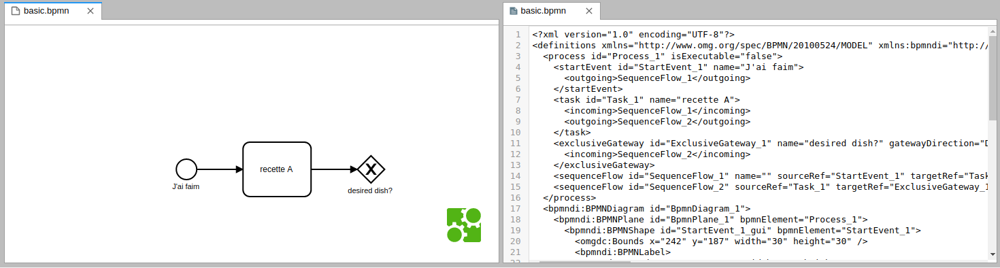
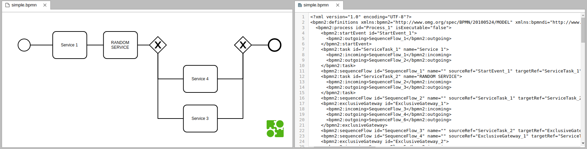
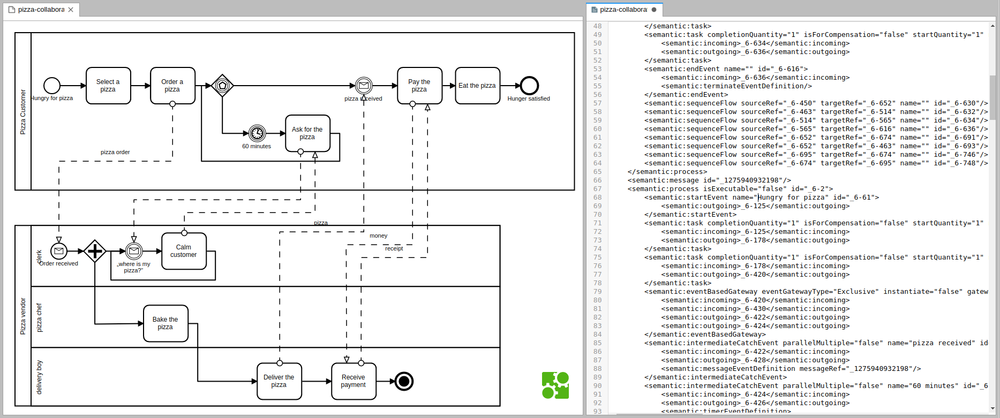

# jupyterlab BPMN

A JupyterLab extension for viewing [BPMN](http://www.bpmn.org) data
files. A file renderer for files with `.bpmn` extensions and a mime renderer for the
`application/bpmn+xml` mimetype is included. This extension uses
[bpmn.js](http://bpmn.io/toolkit/bpmn-js/).


Here are some screenshots from (basic to more complex BPMN files)[https://github.com/bpmn-io/bpmn-io-chrome/tree/master/resources] :







To use the file viewer, right-click on a `.bpmn` file and choose the `bpmn` viewer.

## Prerequisites

* JupyterLab

## Installation

```bash
jupyter labextension install jupyterlab_bpmn
```

## Development

For a development install (requires npm version 4 or later), do the following in the repository directory:

```bash
npm install
jupyter labextension link .
```

To rebuild the package and the JupyterLab app:

```bash
npm run build
jupyter lab build
```

## TODO

* allow visual editing
* add tests
* remove left/top margins
* allow zooming in/out
* add a minimap
